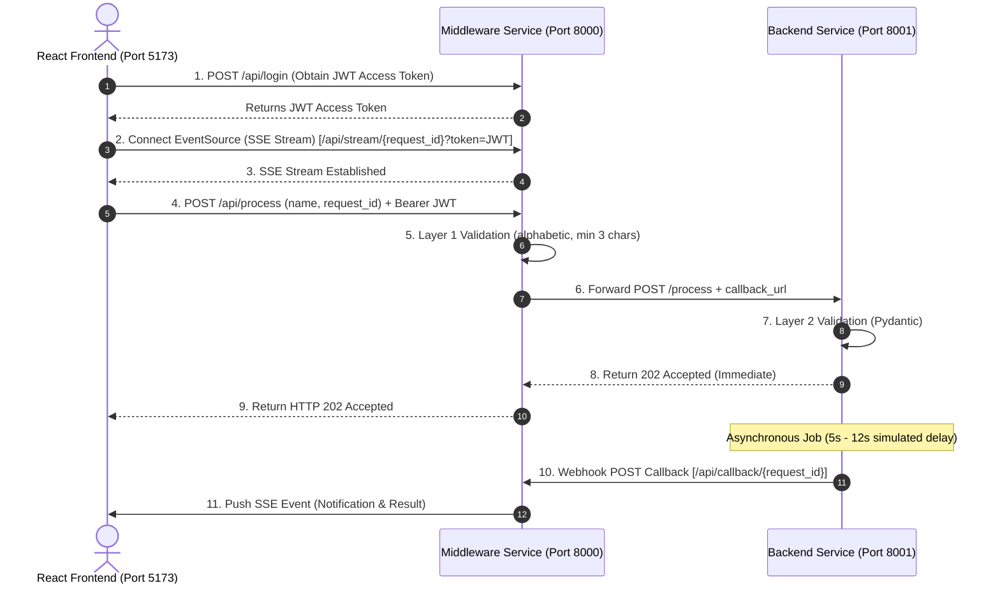

# 3-Tier Asynchronous Architecture Application

A modern 3-tier web application built with **React (TypeScript)**, **FastAPI (Middleware)**, and **FastAPI (Backend)** featuring multi-layer input validation, Server-Sent Events (SSE) for real-time updates, and asynchronous webhook callback notifications.

---

## 🏗️ System Architecture Diagrams

### 1. Component Architecture Flowchart

```mermaid
graph TD
    subgraph Client ["Client Layer (Port 5173)"]
        UI["React + Vite UI"]
        ES["Native EventSource (SSE Listener)"]
    end

    subgraph MiddlewareLayer ["Middleware Layer (Port 8000)"]
        AUTH["JWT Authentication (/api/login)"]
        VAL1["Input Sanitization & Validation"]
        SSE_MGR["SSE Event Queue Manager"]
        WEBHOOK["Callback Webhook Receiver (/api/callback/{id})"]
    end

    subgraph BackendLayer ["Backend Layer (Port 8001)"]
        VAL2["Pydantic Schema Validator"]
        WORKER["Async Background Job (5s - 12s delay)"]
        CLIENT["HTTPX Async Client (Webhook Trigger)"]
    end

    UI -->|1. Auth POST /api/login| AUTH
    UI -->|2. Establish SSE Connection| ES
    ES <-->|Real-time Stream /api/stream/{id}| SSE_MGR
    UI -->|3. Submit Request POST /api/process| VAL1
    VAL1 -->|4. Forward Request + Callback URL| VAL2
    VAL2 -->|5. Immediate 202 Accepted| UI
    VAL2 -->|6. Spawn Task| WORKER
    WORKER -->|7. Task Complete| CLIENT
    CLIENT -->|8. POST Webhook Data| WEBHOOK
    WEBHOOK -->|9. Push Event| SSE_MGR
    SSE_MGR -->|10. Stream Update| ES
```

---

### 2. Asynchronous Sequence Diagram

The system uses an asynchronous callback pattern to handle long-running backend processing without blocking HTTP connections:



---

## ✨ Features

- **Multi-Layer Input Validation:**
  - **Middleware Validation:** Client requests are sanitized and checked for minimum length (at least 3 characters) and allowed characters (alphabetic letters only).
  - **Backend Validation:** Pydantic models enforce schema rules before starting asynchronous execution.
- **Asynchronous Webhook Pattern:**
  - Backend immediately returns `202 Accepted` to free resources while running a background task (5s to 12s execution time).
  - Upon task completion, Backend invokes a POST callback URL provided by the Middleware.
- **Real-Time Client Updates:**
  - The React frontend establishes a native `EventSource` connection for Server-Sent Events (SSE).
  - Webhook results trigger instant UI updates without polling.

---

## 🛠️ Technology Stack

| Layer | Technology | Port |
| :--- | :--- | :--- |
| **Frontend** | React 18, TypeScript, Vite | `5173` |
| **Middleware** | FastAPI, Uvicorn, HTTPX, Pydantic | `8000` |
| **Backend** | FastAPI, Uvicorn, Asyncio, Pydantic | `8001` |

---

## 📁 Repository Structure

```
.
├── backend/
│   ├── main.py              # Backend FastAPI app (Async processing & webhooks)
│   └── requirements.txt     # Python dependencies for Backend
├── middleware/
│   ├── main.py              # Middleware FastAPI app (Validation & SSE manager)
│   └── requirements.txt     # Python dependencies for Middleware
├── frontend/
│   ├── src/                 # React UI components & styling
│   ├── index.html
│   ├── package.json         # Node.js dependencies
│   └── vite.config.ts
├── .gitignore               # Ignored files (venv, node_modules, .env, etc.)
└── README.md                # Project documentation
```

---

## 🚀 Getting Started

### Prerequisites

- **Python 3.10+**
- **Node.js 18+** & **npm**

---

### Step 1: Set Up & Run Backend Service

```bash
cd backend
python -m venv venv
source venv/bin/activate    # On Windows: venv\Scripts\activate
pip install -r requirements.txt
uvicorn main:app --host 127.0.0.1 --port 8001 --reload
```

*Backend API docs available at: `http://127.0.0.1:8001/docs`*

---

### Step 2: Set Up & Run Middleware Service

Open a new terminal window:

```bash
cd middleware
python -m venv venv
source venv/bin/activate    # On Windows: venv\Scripts\activate
pip install -r requirements.txt
uvicorn main:app --host 127.0.0.1 --port 8000 --reload
```

*Middleware API docs available at: `http://127.0.0.1:8000/docs`*

---

### Step 3: Set Up & Run Frontend Application

Open a third terminal window:

```bash
cd frontend
npm install
npm run dev
```

*Open your browser and navigate to: `http://localhost:5173`*

---

## 📡 API Reference

### Middleware Endpoints (`Port 8000`)

- `GET /health` – Health check status.
- `POST /api/login` – Generates JWT Access Token.
- `GET /api/stream/{request_id}` – SSE stream connection for client events.
- `POST /api/process` – Accepts `{ name, request_id }`, validates name, and forwards request to backend.
- `POST /api/callback/{request_id}` – Webhook endpoint called by backend upon job completion.

### Backend Endpoints (`Port 8001`)

- `GET /health` – Backend health check.
- `POST /process` – Accepts validated payload and `callback_url`, spawns async background task, returns `202 Accepted`.

---

## 🌿 Git Workflow & Branching

To work on new features, follow this branch workflow:

```bash
# 1. Create and switch to a new branch
git checkout -b feature/your-feature-name

# 2. Stage and commit your changes
git add .
git commit -m "Description of changes"

# 3. Push the new branch to GitHub
git push -u origin feature/your-feature-name
```
